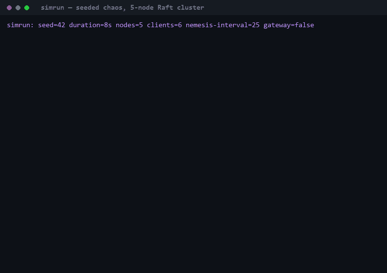
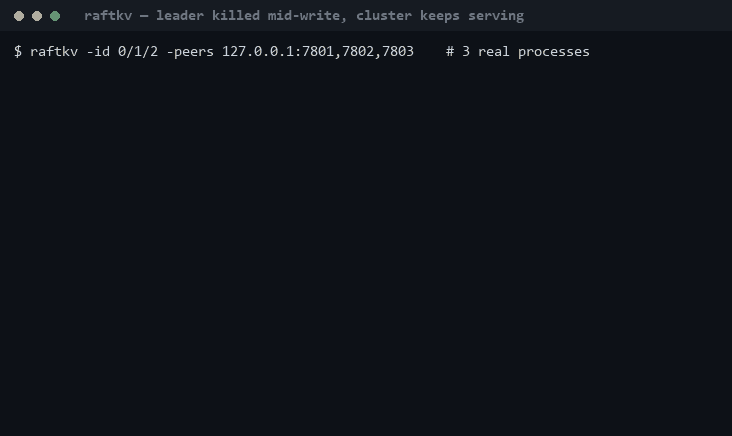
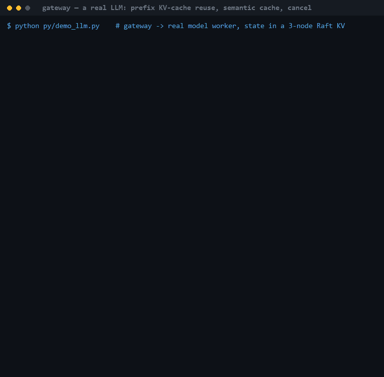

# dsys — a Raft-backed control plane and LLM serving gateway, built from the write-ahead log up

[](https://github.com/Kaif10/distributed-llm-platform/actions/workflows/ci.yml)
[](LICENSE)

A Raft-replicated, sharded control plane with a lease-and-fencing job scheduler and a
stateless serving gateway doing rate limiting, semantic caching, prefix-aware routing and
hedging — plus a seeded chaos harness that checks the whole thing with a linearizability
checker. **No consensus libraries: Raft is implemented from the paper.**

Go and Python. 18 test packages, all passing under `go test -race`.

> **Two things stated up front, because they change what this project claims.**
> There are **two inference backends**. The default is a **mock** with a deliberate,
> written-down latency model — it is what makes the benchmarks reproducible, and most
> benchmark numbers below came from it. There is also a **real backend** (`--backend hf`)
> that runs an actual HuggingFace causal LM with genuine prefix KV-cache reuse. The full
> serving test suite passes against it and its numbers are labelled separately below, but
> it runs a 135M model on CPU, so it demonstrates the mechanism rather than serving at scale. And this is built with production
> **practices** (race-clean tests, chaos engineering, linearizability checking, tracing,
> metrics) but it is **not production-grade**: no auth, no TLS, no security review, no
> batching across requests, no multi-machine durability, no deployment story. Details in
> [DESIGN.md](DESIGN.md) §1.

---

## Seeded chaos against a 5-node Raft cluster

One command injects partitions, pauses and crashes on a seeded schedule, then checks the
resulting history with [Porcupine](https://github.com/anishathalye/porcupine) for
linearizability and verifies every scheduler job committed exactly once. A failing run
prints the exact command to reproduce it.



## A real cluster losing its leader mid-write

Three `raftkv` processes. The leader is killed while the cluster is serving. A majority
survives, elects a new leader, and no acknowledged write is lost — with no manual
intervention and no client-visible failure.



## A real LLM behind the gateway

One SmolLM2-135M worker on CPU, behind the gateway, with routing and cache state in a
3-node Raft KV. A cold request; a different question sharing the same system prompt, which
the semantic cache correctly refuses to answer while the worker reuses the prompt's real KV
cache (`prefix_cache_hit=true`, less prefill time); a typo'd repeat answered by the semantic cache
with no model call; and a client that hangs up, whose cancel reaches the worker.



*All three GIFs are rendered from real captured runs — `scripts/record_demo.sh` runs the actual
binaries, timestamps every line of output, and `scripts/make_demo_gif.py` replays that
timing. Nothing is staged or re-typed.*

---

## Start here

| Document | What's in it |
|---|---|
| **[DESIGN.md](DESIGN.md)** | Architecture, per-endpoint consistency guarantees, nine design trade-offs each naming the alternative rejected, two full request traces, failure modes |
| **[BENCHMARKS.md](BENCHMARKS.md)** | Every measured number with the conditions that produced it |
| **[docs/phase7.md](docs/phase7.md)** | The narrative write-up, including the parts where the approach was wrong |
| `docs/phase1.md` … `docs/phase6.md` | Each layer in depth: design reasoning, war stories, exercises, interview Q&A |
| [ROADMAP.md](ROADMAP.md) | The original seven-phase plan |

## What it does

```
                      ┌─────────────────────────────────────────────┐
  clients ──Generate──►  gateway (stateless, N replicas)             │
                      │   1. rate limit   per-tenant token bucket    │
                      │   2. cache        semantic, shared index     │
                      │   3. route        prefix-affinity, load-aware│
                      │   4. hedge        cancel the loser           │
                      └───────┬──────────────────────┬───────────────┘
                              │                      │
                    inference workers        ┌───────▼────────┐
                    (mock / HF path)         │  scheduler     │  leases + fencing
                                             │  exactly-once  │  tokens, CAS-only
                                             └───────┬────────┘
                                                     │
                     ┌───────────────────────────────▼─────────────────────┐
                     │  sharded, Raft-replicated KV                        │
                     │  shardctrl (its own Raft group) assigns shards →    │
                     │  shardkv groups, live migration, dedup sessions     │
                     │  move with the data                                 │
                     └─────────────────────────────────────────────────────┘
                              verified by: chaos/ (seeded, Porcupine)
                              observed by:  obs/ (OTel → Jaeger, Prometheus)
```

**Phase by phase:** a write-ahead log with crash recovery and group commit → Raft from the
paper (elections, replication, persistence, snapshots) → sharding with live migration that
preserves exactly-once semantics across shard moves → a job scheduler built purely from
compare-and-swap, where leases give liveness and a fencing token gives safety → an LLM
serving gateway → chaos testing and observability.

## Selected results

Full context and conditions in [BENCHMARKS.md](BENCHMARKS.md). All on one 8 GB laptop, so
**ratios travel, absolutes don't.**

| | Result | What it shows |
|---|---|---|
| Group commit | 1,082 → **11,312** puts/s | Amortizing fsync across a batch; p50 unchanged, so the win is throughput, not latency |
| Cost of consensus | 11,312 → **339** puts/s | The same store replicated across 3 processes on the same disk. This ~33x gap is what consensus costs |
| Raft group commit | 192 → **1,385** ops/s at 64 clients, p99 596 → 71 ms | The KV had been capped at one write per fsync whatever the concurrency; found by benchmarking the gateway above it |
| Exactly-once under chaos | 2,000 jobs, 1,334 lease-expiry pauses, 1,124 crashes, **1,314 zombie writes fenced**, exactly 2,000 commits | No job ever committed twice |
| Linearizable across shard moves | **3,191 ops, 3 groups, 0 violations** | Porcupine-clean while shards migrate live |
| Prefix-aware routing | cache hit rate 0.20 → **0.60** | …and throughput got *worse* (20.4 → 13.4 req/s). Affinity balances prefixes, not load — see below |
| Hedging on top | p99 TTFT 4,232 → **2,076 ms**, hedging 23% of requests | Recovers the tail the hot-spot created. An earlier 1,515 → 958 ms figure hedged 62% of requests: load-spreading, not tail hedging ([correction](BENCHMARKS.md#correction-2026-10-01-the-original-hedging-result-was-mostly-load-spreading)) |
| Chaos suite | 12 seeds, **0 violations** | Plus 14/14 checks against real containers |

### Real model, real prefix cache

`--backend hf` runs an actual HuggingFace causal LM (default SmolLM2-135M-Instruct) with
genuine KV-cache prefix reuse — the mechanism behind vLLM's automatic prefix caching and
SGLang's RadixAttention. A request finds the longest cached block-aligned token prefix,
reuses those `past_key_values`, and prefills only the remaining suffix. Measured through
the full gateway on CPU:

| Request | Prefill | `prefix_cache_hit` |
|---|---|---|
| Cold, first ever | 265 ms | false |
| Same system prompt, different question | **139 ms** | **true** |
| Unrelated prompt (warm cache) | 62 ms | false — correctly missed |

So `prefix_cache_hit` means computation genuinely skipped, not a simulated flag, and the
prefill difference is measured rather than modelled.

**And the whole Phase 5 end-to-end suite passes against the real model.**
`BACKEND=hf scripts/e2e_llm.sh` runs every check the mock run does (prefix routing, hedging,
semantic cache, rate limiting, cancellation) against two real-model workers, sized for an 8 GB
laptop: 80 requests, 6 system prompts, and a prefix cache smaller than the working set.

| | A: least-loaded | B: prefix routing | C: + hedging |
|---|---|---|---|
| prefix-cache hit rate | 0.44 | **0.83** | 0.74 |
| mean prefill (forward pass only) | 454 ms | **327 ms** | 361 ms |
| prefix spread (workers per prefix) | 2.00 | **1.00** | 1.67 |
| TTFT p99 | 10.8 s | 12.3 s | **9.7 s** |
| request split | 52 / 28 | 25 / 55 | 41 / 39 |
| hedges launched / won | – | – | 16 / 16 |

The same run also passed the semantic cache (49/50 on repeats), rate limiting and cancellation
checks. The tradeoff the mock exposed shows up with real weights: affinity nearly doubles cache
hits and sends 55 of 80 requests to one worker. Hedging, tuned to fire only on the tail (20% of
requests), recovers the p99 while keeping most of the affinity. Affinity balances prefixes, not
load — now confirmed with real weights, not a latency model. Absolute latencies come from a
throttled laptop CPU on battery; read the ratios. The mock remains the default because
it makes benchmarks deterministic and needs no weights; the real path proves the semantics
the router is built on actually hold. Implementation and its honest limits (no batching,
no paged KV sharing, greedy decoding) in [`py/hf_backend.py`](py/hf_backend.py).

**The most interesting result is a regression.** Prefix-aware routing tripled the worker
cache hit rate and simultaneously made throughput and tail latency worse, because hashing
12 prefixes onto 4 workers handed two of them ~85% of the traffic. Reporting hit rate alone
would have shipped a throughput regression as a win. Hedging then recovered the tail.
Written up in [docs/phase5.md](docs/phase5.md).

## Bugs the tests actually caught

The engineering record, not a highlight reel. Each is written up where it happened:

- **Rendezvous hashing put half the keyspace on one worker in five.** FNV-1a's weak
  avalanche let the worker ID's last byte dominate the score. A loose test bound would have
  passed it. Fixed with a splitmix64 finalizer → 528/472/500/500.
- **Load-aware routing was blind**, reading only registry counts refreshed once per worker
  lease, so concurrent bursts all saw stale zeros and piled onto one worker.
- **A benchmark that couldn't fail.** The first serving benchmark used 4 prompts, 4 workers
  and a default-size cache, so every worker cached everything within seconds and the
  baseline already scored 0.9. Made cache-capacity-bound to mean anything.
- **The chaos nemesis pushed the cluster below quorum**, then reported Raft correctly
  refusing to operate as a "violation". Fixed by bounding it to a minority of failures.
- **Fixing that broke a reproducibility test** — which turned out to be asserting something
  the design deliberately doesn't guarantee. The test was wrong, not the fix.
- **The semantic cache could answer a different question.** Two different questions behind
  the same long system prompt embed at cosine 0.93, above the 0.92 near-hit threshold,
  because n-gram similarity is dominated by the text they share. The tests only used short
  prompts, so they never saw it; recording the real-model demo did. Near hits are now
  confirmed by a bounded edit distance against the stored prompt, and a regression test
  fails without the fix.
- **The published hedging win was mostly load-spreading.** It hedged at 250 ms, below the
  median latency, so 62% of requests were hedged. Running the suite against the real model
  exposed it. The e2e now fails if hedges reach half the requests;
  [re-measured](BENCHMARKS.md#correction-2026-10-01-the-original-hedging-result-was-mostly-load-spreading)
  with the old numbers kept beside the correction.
- **Consensus was capped at one write per fsync.** Benchmarking the gateway (27 req/s) led two
  layers down to Raft rewriting and fsyncing its whole log per append, holding its lock.
  Group commit took the KV from ~200 to 1,385 ops/s at 64 clients. Getting the tests green
  then exposed a race in the Raft test harness itself; it was confirmed by logging rather than assumed.
- **Real-model "prefill" included queueing**, timed from before the worker's model lock, and
  the mocks counted injected stalls as prefill. Both now report compute only.

---

## Quickstart

All tooling is project-local under `.tools/` (Go, protoc, make, gcc) and `.venv/` (Python).
Nothing is installed system-wide.

```powershell
. .\env.ps1            # PowerShell: activate Go/protoc/make   (source ./env.sh in bash)
make build             # all binaries into bin/
make test              # unit tests
```

```powershell
make test-crash        # kill-mid-write durability test, 200 iterations
make test-raft         # Raft suite: elections, replication, persistence, snapshots
make test-lin          # Porcupine linearizability under partitions and crashes
make test-shard        # sharding: rebalancing + migration, linearizable across shard moves
make test-sched        # scheduler: exactly-once under 1000+ pauses/crashes
make test-llm          # gateway, rate limiter, prefix router, semantic cache
make test-chaos        # 12 seeds x KV+scheduler(+gateway) chaos
make simrun            # one seeded chaos run, verbose
make e2e-sched         # scheduler e2e against real processes (crash + zombie worker)
make e2e-llm           # serving e2e: prefix routing and hedging measured vs baselines
make e2e-llm-hf        # the same e2e checks against REAL model workers (needs torch)
make chaos-docker      # chaos against REAL containers (needs Docker Desktop)
make obs-up            # Prometheus + Grafana + Jaeger   (make obs-down to stop)
```

```bash
source ./env.sh        # Git Bash equivalent
```

Three-node replicated cluster (one terminal each), then talk to any node:

```powershell
# Raft (peer-only) on 17001-17003, KV clients on 7001-7003; these are the defaults
.\bin\raftkv.exe -id 0 -peers 127.0.0.1:17001,127.0.0.1:17002,127.0.0.1:17003 -client-addrs 127.0.0.1:7001,127.0.0.1:7002,127.0.0.1:7003
.\bin\raftkv.exe -id 1 -peers 127.0.0.1:17001,127.0.0.1:17002,127.0.0.1:17003 -client-addrs 127.0.0.1:7001,127.0.0.1:7002,127.0.0.1:7003
.\bin\raftkv.exe -id 2 -peers 127.0.0.1:17001,127.0.0.1:17002,127.0.0.1:17003 -client-addrs 127.0.0.1:7001,127.0.0.1:7002,127.0.0.1:7003
.\bin\kvctl.exe -addr 127.0.0.1:7001,127.0.0.1:7002,127.0.0.1:7003 put k v
.\bin\kvctl.exe -addr 127.0.0.1:7001,127.0.0.1:7002,127.0.0.1:7003 bench -n 500 -c 8
```

Kill the leader's terminal mid-bench and watch `retries:` climb while every put still lands exactly once.

Sharded cluster (Phase 3): a controller cluster plus two independent replica
groups, each group a full Raft cluster of its own.

```powershell
# controller (3 terminals); defaults: Raft (peer-only) on 18001-18003, clients on 8001-8003
.\bin\shardctrl.exe -id 0
.\bin\shardctrl.exe -id 1
.\bin\shardctrl.exe -id 2

# group 100 (3 terminals): Raft + shard migration (peer-only) on 19001-19003, KV clients on 9101-9103.
# -peer-map lists client=peer for the replicas of every OTHER group (own group is implicit).
$P = "127.0.0.1:19001,127.0.0.1:19002,127.0.0.1:19003"; $C = "127.0.0.1:9101,127.0.0.1:9102,127.0.0.1:9103"
$MAP = "127.0.0.1:9201=127.0.0.1:19201,127.0.0.1:9202=127.0.0.1:19202,127.0.0.1:9203=127.0.0.1:19203"
.\bin\shardkv.exe -gid 100 -id 0 -peers $P -client-addrs $C -peer-map $MAP -ctrl 127.0.0.1:8001,127.0.0.1:8002,127.0.0.1:8003
.\bin\shardkv.exe -gid 100 -id 1 -peers $P -client-addrs $C -peer-map $MAP -ctrl 127.0.0.1:8001,127.0.0.1:8002,127.0.0.1:8003
.\bin\shardkv.exe -gid 100 -id 2 -peers $P -client-addrs $C -peer-map $MAP -ctrl 127.0.0.1:8001,127.0.0.1:8002,127.0.0.1:8003

# register the group by its CLIENT addresses and talk to the cluster
.\bin\shardctl.exe -ctrl 127.0.0.1:8001,127.0.0.1:8002,127.0.0.1:8003 join 100=127.0.0.1:9101,127.0.0.1:9102,127.0.0.1:9103
.\bin\kvctl.exe -ctrl 127.0.0.1:8001,127.0.0.1:8002,127.0.0.1:8003 put k v
```

Start a second group (`-gid 200`, peers 19201-19203, clients 9201-9203, `-peer-map` pointing
at group 100's pairs) and `shardctl join 200=<its client addresses>`
while writes are in flight: the controller rebalances shards onto it live,
each shard's data and dedup sessions migrate, and every key keeps resolving
through `kvctl` with no manual intervention.

Job scheduler (Phase 4) on top of any KV cluster above, flat or sharded:

```powershell
.\bin\sched.exe -addr 127.0.0.1:7400 -kv 127.0.0.1:7001,127.0.0.1:7002,127.0.0.1:7003
.\bin\worker.exe -sched 127.0.0.1:7400 -name w1 -concurrency 2
.\bin\schedctl.exe -sched 127.0.0.1:7400 submit '{"sleep_ms":200,"echo":"hi"}'
.\bin\schedctl.exe -sched 127.0.0.1:7400 watch 1
```

The roadmap's "break it" experiment: start a worker with `-suppress-heartbeat -slow-after 1`,
watch it finish a job after its lease expired, and see its result refused as fenced while the
job is completed exactly once by another worker. `make e2e-sched` runs that whole scenario
against real processes, plus a crashed worker, and checks every job.

LLM serving layer (Phase 5) on top of any KV cluster above:

```powershell
.\bin\gateway.exe -addr 127.0.0.1:7500 -kv 127.0.0.1:7001,127.0.0.1:7002,127.0.0.1:7003 -hedge-after 1s
.venv\Scripts\python.exe py\infer_worker.py --addr 127.0.0.1:7600 --gateway 127.0.0.1:7500 --worker-id py-0
.venv\Scripts\python.exe py\infer_worker.py --addr 127.0.0.1:7601 --gateway 127.0.0.1:7500 --worker-id py-1
.venv\Scripts\python.exe py\gateway_client.py
.\bin\llmbench.exe -gateway 127.0.0.1:7500 -n 300 -c 16
```

Workers register with the gateway under a lease, so a worker you kill drops out of
routing on its own. `make e2e-llm` runs the whole stack and checks that prefix-aware
routing raises the worker prefix-cache hit rate, that hedging cuts p99 time-to-first-token,
that the semantic cache serves repeats, that per-tenant limits shed load, and that a
cancelled stream actually stops the worker.

Chaos and observability (Phase 6): a seed reproduces a bug, not just a benchmark.

```powershell
go run .\cmd\simrun -seed 42 -duration 10s -nemesis-interval 30 -gateway
```

`simrun` wires a real 5-node Raft KV cluster, a scheduler, and (with `-gateway`) a
gateway and mock workers in one process, drives them with concurrent clients, and
injects partitions/crashes/pauses on a schedule bounded to never take down a
majority. It checks the result with Porcupine (KV linearizability) and an
exactly-once check (every scheduler job completed exactly once), and on failure
prints the exact command to reproduce it. `make chaos-docker` runs the same kind
of chaos against real containers instead (partitions, crashes, `tc netem`
latency/loss injection); `make obs-up` brings up Prometheus, Grafana, and Jaeger
so a request's trace end to end (gateway → worker, or scheduler submit → complete)
is one query away.

## Layout

```
proto/      gRPC + log entry definitions (source of truth for Go and Python)
gen/        generated Go code (make proto)
kv/wal      append-only write-ahead log with crash recovery
kv/store    durable KV: log-then-apply state machine
raft/       Raft: election, replication, persistence, snapshots (no libraries)
raft/simnet seeded simulated network: partitions, drops, delays, reordering
kv/raftkv   replicated KV: Machine driven by Raft, Porcupine-checked
shard/      the shared shard-key mapping (NShards, Key2Shard)
shardctrl/  shard controller: its own Raft group, deterministic rebalancing
shardkv/    shard-owning replica group: 3-kind log (ops, config, migrations)
kv/client   reusable KV client: stable RequestMeta on retry, leader hints,
            shard resolution, wrong-group re-resolution
sched/      job queue built purely from CAS: leases for liveness, a fencing
            token for safety, bounded admission, leader-elected reaper
sched/worker  pull-model worker: heartbeats, cancel-on-fence
kvapi/      the one KV interface every higher layer programs against
ratelimit/  per-tenant distributed token bucket in the KV (CAS)
router/     lease-based worker registry + rendezvous-hash prefix affinity
semcache/   semantic cache: exact index shared in the KV, vectors local
gateway/    rate limit -> cache -> route -> hedge -> stream, with cancellation
            propagated all the way to the worker
infer/mock  GPU-free inference worker with an explicit latency model,
            matched exactly by py/infer_worker.py
chaos/      seed-driven whole-stack simulation harness + nemesis
obs/        OpenTelemetry tracing + Prometheus metrics
docker/     Dockerfiles + compose for real-container chaos
k6/         load test against the gateway's streaming Generate RPC
scripts/    e2e + chaos scenarios, and the demo recorder/renderer
py/         Python client, inference worker, generated stubs
docs/       per-phase write-ups, exercises, interview prep
```

## Status

All seven phases complete.

- [x] Phase 0: toolchain
- [x] Phase 1: durable single-node KV (WAL, CAS, idempotent retries, group commit)
- [x] Phase 2: Raft consensus, replicated KV, linearizability-checked
- [x] Phase 3: sharding, live migration, deterministic rebalancing
- [x] Phase 4: scheduler: leases, fencing tokens, exactly-once commit, admission control
- [x] Phase 5: LLM serving layer: rate limiting, semantic cache, prefix-aware routing, hedging
- [x] Phase 6: chaos + observability: seeded simulation, real-container chaos, tracing/metrics
- [x] Phase 7: write-up (DESIGN.md, BENCHMARKS.md, docs/phase7.md)
- [x] Real model backend: SmolLM2-135M with real prefix KV-cache reuse; the full serving
      e2e suite passes against it (`make e2e-llm-hf`)
